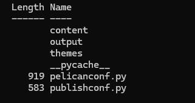
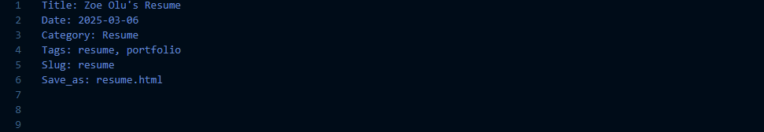
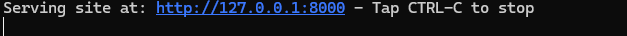
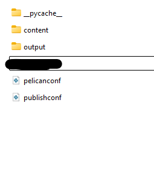
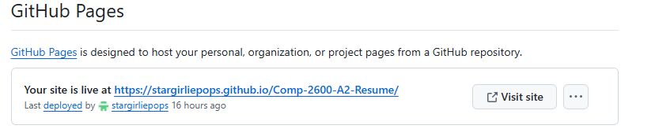

# STATIC WEBSITE CREATION (FOR A RESUME) AND HOSTING THE WEBSITE ON A FORGE 
**This document describes the process for creating, formatting, and hosting a resume. According to Andrew Etter in his book, "Modern Technical Writing," READMEs help to know what a project does and what it relies on to work**
**This document is for anyone who is interested in learning more about a Distributed Version Control System (DVCS), static site generator or forges. They should typically have a basic understanding of how to use Markdown and the command line.**
#### Note: As Etter notes in his book, static websites are useful due to their simplicity, especially for beginner web developers, and security i.e. they do not become unavailable due to an error.**

## PREREQUISITES
#### What you will need to carry out the instructions
- A Resume
- Knowledge of Markdown (headings, lists, bold, italics, links & images)
- A Text Editor (I used **VS Code** to write the Markdown file(s) for my website, you can download the text editor for your operating system here: [Install VS Code](https://code.visualstudio.com/download))
- A Distributed Version Control System (I used Git for my website's files)
- A Static Site Generator (I used Python-based Pelican - it supports Markdown)
- A Forge (To host the static website and that supports the DVCS you choose. I used GitHub.)

## INSTRUCTIONS
#### A guide for you
  
  - ### Step 1 | GENERATING YOUR STATIC WEBSITE
    - Install Python: [Python](https://www.python.org/)
    - On the command line, install Pelican by running this command: **python -m pip install "pelican[markdown]"**
    - Next, navigate to the directory where you want your website to be located on your computer.
    - Now, create a new folder for your website documents.
    - Then run this command inside the new folder to create a website: **pelican-quickstart** (You will need to answer some intuitive questions during this process)
    - You should end up with these documents below or similar ones inside your website folder.
        

  - ### Step 2 | RESUME FORMATTING
    - Using a text editor (e.g. VS Code), format your resume with Markdown using headings to create sections, lists, font styles (bold, italic e.t.c). **Note:** Markdown cannot recreate the format of the resume exactly.
    - At the top of your Markdown document, include these attributes changing the **Title** and **Date** 
    - Save your Markdown file in the folder named **content** within your website folder.

  - ### Step 3 | ADDING YOUR RESUME TO YOUR WEBSITE
    - To turn your resume to a website, Pelican converts the Markdown file into HTML.
    - To do this, run **pelican content** on the command line (in your website's folder) 

  - ### Step 4 | VIEWING YOUR WEBSITE IN YOUR BROWSER
    - To view your static website on your computer, go to the command line and run **pelican --listen**
    - After that, you should see this on the command line: 
    - Ctrl + click on the link to open your website in your browser.
   
  - ### Step 5 | HOSTING YOUR WEBSITE ON A FORGE
    ##### You need other people to be able to view your website on the internet, and to do that, you need to host your site using a forge. For this project, we will use GitHub.
    
      - #### Step A: Creating a new repository on GitHub
        - First, on the command line run this command to install ghp-import: **python -m pip install ghp-import**
        - Next, install your DVCS (in this case, Git) using this link: [Git](https://git-scm.com/)
        - Now, create an account on GitHub if you do not already have one : [GitHub](https://github.com/)
        - After creating your GitHub account, create a new repository, set it to **public**, and name it appropriately
          
      - #### Step B: Setting up your GitHub Project
        - You will need to store your GitHub repository on your computer. This is called *cloning*.
        - To clone your repository, navigate on the command line to a folder where you want this repository stored
        - Then run this on the command line: git clone https://github.com/yourGitHubusername/nameofyourrepository.git
        - Recall the website folder you created earlier, now move it into this cloned repository on your computer (you should see files like in the image in your cloned repository) 
        - Next, commit to GitHub by running these on the command line:
            1. git add .
            2. git commit -am "First commit"
        - Generate the website and send your site to your GitHub repository (under the section called *Pages* by running these on the command line:
            1. pelican content -s publishconf.py
            2. ghp-import output -b gh-pages
            3. git push origin gh-pages
        - Lastly, in your GitHub repository, click on *Settings*
        - Then navigate to a section called *Pages*
        - Click on the link to your website shown on this page. It should look like this: 

#### Now you have a public static website. Yay! 🎉
   
  ## FURTHER RESOURCES
  - When creating the website in **Step 1**, these are the sort of questions to expect and what they mean: [Questions](https://chatgpt.com/share/67ca74f7-8828-8000-bcc2-b79bd3b1ae55) Gotten from ChatGPT
  - Markdown learning resource: [GeeksforGeeks](https://www.geeksforgeeks.org/introduction-to-markdown/)
  - Git and GitHub learning resource : [Git & GitHub](https://www.freecodecamp.org/news/guide-to-git-github-for-beginners-and-experienced-devs/)
  - To learn more about static websites: [Static Websites](https://kinsta.com/knowledgebase/what-is-a-static-website/)

## FAQs
1. "Why use Markdown instead of another lightweight markup language?"
   - According to Etter in his book, some benefits of Markdown are how easy it is to learn for beginners due to its simple syntax, its popularity ensures that there are many text editors for it as well e.t.c.
  
2. "I can't seem to successfully clone my repository to my local computer, why?"
   - There are quite a few reasons for this. Try these:
     - **STEP A**
       - Check if the GitHub repository is public (You should see either **Public** or **Private** this beside your repository name on GitHub).
       - If Public, go to **STEP B**.
       - If Private, scroll down on the **Settings** page to a section **Danger Zone**
       - Then click on **Change Visibility** and set to Public
         
    - **STEP B**
       - On the command line check if you have Git installed by running this command: git --version
       - If installed, you should see an output like : git version 2.48.1.windows.1 (Note: the numbers may vary, that is fine)
       - If not installed, install Git here: [Git](https://git-scm.com/)
       - Move to **Step C**
     
    - **STEP C**
       - Try cloning the repository again using this command and making sure to substitute in your GitHub username and repository name: git clone https://github.com/username/repositoryname.git

## CREDITS
### Kikiola Ojuko (author)
### Tofunmi Layi-Babatunde (peer reviewer)
### Nathaniella Ogogo (peer reviewer)
### This website uses the default theme (notmyidea-cms) Provided by Pelican
### This README references the following book:
*Modern Technical Writing: An Introduction to Software Documentation* by Andrew Etter, 2016
